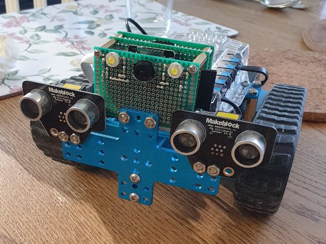
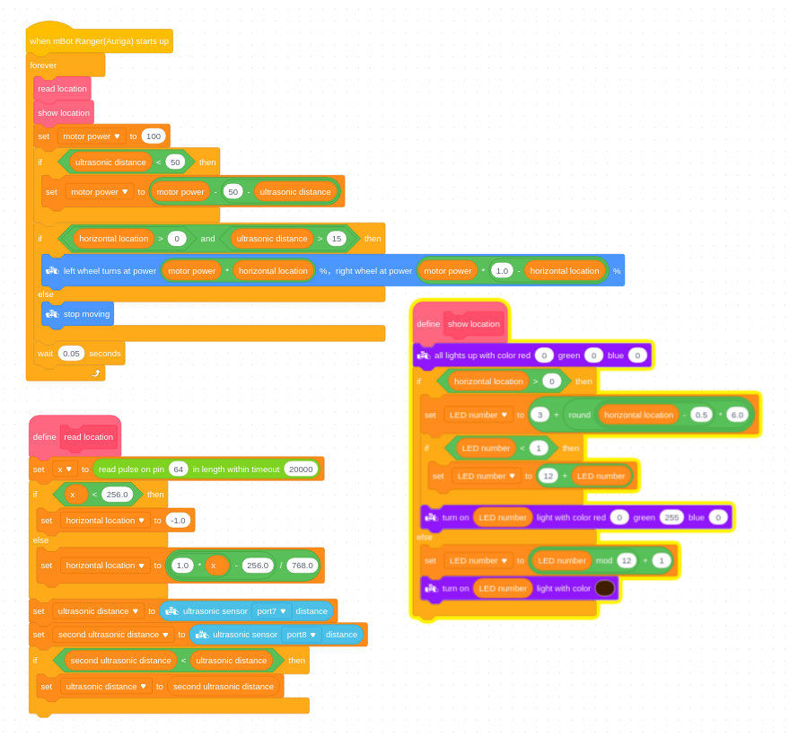

# mBot Vision

Equip your [Makeblock mBot](https://www.makeblock.com/) with a cheap ESP32 and use machine learning 
to recognize objects you've train it to. The included example will make the mBot chase after colored balls!



You can make it recognize other types of objects by recording some videos and retraining. The 
[model/](model/) folder contains a dataset creation and model training pipeline. You can record 
your own videos and photos and drop them into the dataset folder to train on.

The ESP32 communicates the object location to the mBot using a simple PWM encoding. This
ensures the object position can be read from the kids-friendly Scratch / Blocks programming IDE. 

The ESP32 also includes a web-server with a camera live stream, so you can use to see what
the robot sees when you drive it around. The live stream can also show you the model 
inputs (low-res images) and outputs (object heatmaps).

Supported boards

 * The [ESP32-S3-WROOM CAM](https://www.aliexpress.com/item/1005004960637276.html) (or the more expensive [ESP32-S3-EYE](https://github.com/espressif/esp-who/blob/master/docs/en/get-started/ESP32-S3-EYE_Getting_Started_Guide.md)) is a capable MCU with improved ML performance using vector instructions and faster PSRAM, e.g. 5-10 FPS depending on the model.
 * The [ESP32 CAM](https://www.aliexpress.com/item/1005003804757059.html) is a cheap but capable MCU with reasonable ML performance, e.g. 1-5 FPS depending on the model.

# Programming the MCU

## Inference engines

This project uses an [ESP32 specific flavor](https://github.com/espressif/tflite-micro-esp-examples) 
of [TensorFlow Lite for Microcontrollers](https://github.com/tensorflow/tflite-micro) as the default 
inference engine. 

There's also experimental support for [TinyMaix](https://github.com/sipeed/TinyMaix), but this 
inference engine doesn't support so many of the TFLite operators so you'll need to really strip down the 
model to be able to run it.

## Setup tflite-micro

You need to prepare the ESP32 specific tflite-micro distribution a bit in order to make it usable from PlatformIO
and get the ESP32 optimized kernels. [These kernels](https://github.com/espressif/tflite-micro-esp-examples#esp-nn-integration) 
can make a 3x factor change in inference performance on the ESP32, or even more on an ESP32-S3.

```
git clone https://github.com/mikljohansson/mbot-vision.git

# Clone the ESP32 flavor of the tflite-micro distribution
git clone --recurse-submodules https://github.com/espressif/tflite-micro-esp-examples.git
cd tflite-micro-esp-examples

# Optionally update the tflite-micro base to get compatiblity with latest TFLite ops and kernels
#scripts/sync_from_tflite_micro.sh

# If you're targeting a ESP32 then remove all the optimized kernels for the new ESP32-S3
# architecture since this will otherwise cause build problems in PlatformIO
#find components/esp-nn -name '*esp32s3*' -exec rm -f {} ';'

# Remove all the default tfmicro kernels in favor of the ESP32 optimized kernels (otherwise they'll get used by the linker for some reason)
for f in components/tflite-lib/tensorflow/lite/micro/kernels/esp_nn/*.cc; do rm components/tflite-lib/tensorflow/lite/micro/kernels/`basename $f`; done
```

## Create a WiFi config

Copy [mbot-vision-config.h-example](eye/include/mbot-vision-config.h-example) to `eye/include/mbot-vision-config.h` and edit it to include the names and passwords of your WiFi networks.

## ESP32-S3-WROOM CAM setup

Install the CH343 USB-serial driver from here https://github.com/WCHSoftGroup/ch343ser_linux so the board is detected as a /dev/tty* device

## Program the microcontroller using PlatformIO

* Open `mbot-vision.code-workspace` in the [PlatformIO IDE](https://platformio.org/)
* Remove (or change) `upload_port=` and `monitor_port=` from [platformio.ini](eye/platformio.ini)
* Change the WiFi SSID and passwords in [eye.cpp](eye/src/eye.cpp)
* Connect the ESP32 and program it
* The ESP32 will print its IP address and other info on the serial bus, as well as show it 
  on the OLED screen if one is connected.

# Block programming the mBot

This Scratch program will make the mBot chase after the detected object. You may need to adjust it a bit if you don't have 2 separate ultrasonic sensors connected. 

The program works better if you use the "Upload" mode (compiled C++ code) instead of the "Live" mode (each block instruction streamed to the robot). This is due to the upload mode being a lot faster, so the robot gets quicker response times to movements. You can of course debug the program in Live mode until it works as intended, and then upload it.



# Hardware setup and wiring

See [wiring.h](eye/include/mbot-vision/wiring.h) for how to wire up the ESP32 with the mBot

## Required wiring

* `MV_PWMX_PIN` and `MV_PWMY_PIN` encodes the object X and Y positions using PWM 
  signals. These signals can be read using the joystick input block on the mBot.

   * The x and y location of the object will be encoded as PWM signals with a frequency in the 
     range of `[min=256Hz, max=1024Hz]`. The frequency corresponds to the location of the object 
     in the camera frame. You can measure the exact output values that the robot gives using the 
     Joystick sensor block in Scratch or use the `pulseIn` function in Arduino. 

   * A PWM value of `min` indicates the object is to the left-most (x-dimension) or 
     bottom-most (y-dimension) position, and `max` indicates the object is to the right or 
     top respectively.

   * If no object it detected it will output a signal of `32Hz` on both x and y channels.

See [mbot-pwm.cpp](eye/src/mbot-pwm.cpp) for details.

## Optional wiring

* `MV_SDA_PIN` and `MV_SCL_PIN` can be used to connect a cheap SSD1306 0.96" OLED display that 
  supports the I2C protocol, for example something [like this](https://randomnerdtutorials.com/guide-for-oled-display-with-arduino/). The display will show the ESP32's IP address and some 
  other information, perhaps in the future it can show the object detection output too.

* `MV_FLASH_PIN` will output a PWM signal to control some flood lights from the web UI, for example
  some high power LED's connected with a transistor and some suitably sized resistors.

* You can set the `LOG_TO_SDCARD` define to log images to an SDcard. This way you can drive 
  the mBot around by remote and record training images. Since the SDcard pins are shared, 
  it means that in this case you must also disconnect all other wires like the 
  floodlights and mBot connection.

## FDTI programmer for the ESP32-CAM board

The ESP32-CAM unfortunately doesn't have a RST pin, so in order to get the programmer to 
automatically put it into programming/flashing mode you need to solder a wire onto the 
inner connector of the RST button and connect that to the RTS pin on the FTDI programmer. 
Doing this will allow you to upload new firmware without having to manually hold down the 
I00 button or press the RST button.

|Programmer|ESP32 CAM|
|----------|---------|
|5V        |5V       |
|GND       |GND      |
|TXD       |U0R      |
|RXD       |U0T      |
|DTR       |I00      |
|RTS       |RST      |

# Machine learning model

There's code for a few different models available in [src/models](model/src/models) and which one 
to use can be configured in the [Makefile](model/Makefile). If you switch models you may also need 
to adjust the input and output dimensions in the Makefile. The model hyperparameters are configured
in [src/configs](model/src/configs).

## Setup

```
sudo apt-get install ffmpeg

cd mbot-vision/model
python3 -m venv venv
. venv/bin/activate

pip install torch==1.13.1 torchvision --extra-index-url https://download.pytorch.org/whl/cu117
pip install -r https://raw.githubusercontent.com/ultralytics/yolov5/master/requirements.txt
pip install nvidia-pyindex
pip install -r requirements.txt
```

## Model information

You can see the layers and configuration of the model like so:

```
# Show PyTorch model summary
make summary

# Show information about a quantized TFLite model
EXPERIMENT=experiments/master/20220708-100725 make summary-tflite
```

## Datasets

The dataset generation pipeline can use two sources of data

* Your own recorded videos and images. These will be automatically annotated using a YOLO model, 
  to produce segmentation maps which is then used as training data.

* MS COCO pre-annotated images, which will be automatically downloaded as needed

### Configuring what types of object to detect

See the comma separated lists of COCO classes in the [Makefile](model/Makefile) in the
`PRIMARY_CLASSES` and `SECONDARY_CLASSES` variables. Here's the 
[full list](model/src/coco-labels-2014_2017.txt) of available classes.

Change `PRIMARY_CLASSES` to include the classes you're interested in detecting, and 
change `SECONDARY_CLASSES` to include any classes that are often confused with the primary 
classes. For example apples and oranges can easily be confused for sports balls :)

### Building the dataset

Put your own recorded videos into `dataset/recorded/videos` and images into 
`dataset/recorded/images`. You can for example record some videos of the objects you 
want to detect, 10-20 minutes of video should be enough to get going with.

Run `make dataset` to create the training dataset. This will:

* Download relevant images from the MS COCO dataset
* Extract individual frames from your recorded videos
* Use YOLOv5 to annotate your recorded frames and images
* Create training samples from COCO and your own videos/images

## Training

Use `make tensorboard` to start a TensorBoard instance in the background, this can be used 
to monitor the training runs and plot the loss.

Run `make train` to train and package the model. This will:

* Pre-train on MS COCO images and some negative samples
* Fine-tune on your recorded videos and images
* Convert to TFlite format and quantize to `int8`
* Convert to C++ files which are symlinked into the [eye/](eye/) PlatformIO project

You will find the resulting models stored in `model/experiments/branchname/date`.

## Validation

You can test the resulting models using for exampel:

```
EXPERIMENT=experiments/master/20220708-100725 make validate
```

This will output input and output images into `experiments/master/20220708-100725/validation/` which
shows the model input and output from PyTorch and quantized TFlite models, so you can see how they
perform on your data.

## Command line examples

Examples:
```
# Start tensorboard in the background
make tensorboard

# Will use GPU if available to run the YOLO model used for annotating images
make dataset

# Prepare dataset on CPU
CUDA_VISIBLE_DEVICES= make dataset

# Use the first available GPU for training.
make train

# Use specific GPU for training.
CUDA_VISIBLE_DEVICES=1 make train

# Train on CPU, this model is so small that it can easily be trained on CPU
CUDA_VISIBLE_DEVICES= make train

# Run inference on a sample of images, the output ends up in experiments/something/date/validation
EXPERIMENT=experiments/something/date make validate
```

# Setting up /dev aliases for the ESP32 and mBot

You can setup /dev/something aliases for the different microcontroller, for example to avoid them
getting assigned randomly as /dev/ttyUSB0 or /dev/ttyUSB1 when connecting multiple MCU's at the same time.

See [this guide](https://medium.com/@darshankt/setting-up-the-udev-rules-for-connecting-multiple-external-devices-through-usb-in-linux-28c110cf9251)
for how to setup aliases for the USB-to-serial chips that are used to program the ESP32 and mBot Arduino.

```
sudo vi /etc/udev/rules.d/99-usb-aliases.rules

SUBSYSTEM=="tty", ATTRS{idVendor}=="0403", ATTRS{idProduct}=="6001", SYMLINK+="ftdi"
SUBSYSTEM=="tty", ATTRS{idVendor}=="1a86", ATTRS{idProduct}=="7523", SYMLINK+="auriga"
SUBSYSTEM=="tty", ATTRS{idVendor}=="1a86", ATTRS{idProduct}=="55d3", SYMLINK+="esp32s3cam"

# sudo rm -f /usr/lib/udev/rules.d/90-brltty-device.rules

sudo systemctl mask brltty-udev
sudo systemctl mask brltty

sudo systemctl stop brltty-udev
sudo systemctl stop brltty

sudo udevadm control --reload-rules && sudo udevadm trigger
```

# Common issues

## Invalid/corrupt model file

```
Starting object detector
Guru Meditation Error: Core  1 panic'ed (LoadProhibited). Exception was unhandled.
```

```
abort() was called at PC 0x400eafc8 on core 1
```

These errors probably means that the tflite file that is encoded into the model buffer 
in `mbot-vision-model.cpp` is not a valid for some reason.

## Camera initialization

```
Camera probe failed with error 0x20002.E (2827) gpio: gpio_install_isr_service(449): GPIO isr service already installed
```

Probably means the ESP32 just needs to be power-cycled.
